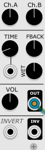
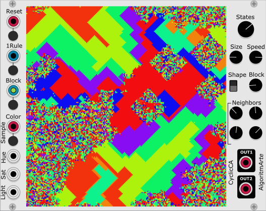

# AlgoritmarteVCVPlugin
Algoritmarte VCV Rack Modules

- [Clockkky](#clockkky) : clock/trigger sequencer
- [Planetz](#planetz) : random sequence generator
- [MusiFrog](#musifrog) : another musical sequence generator
- [Zefiro](#zefiro) : full synth inspired by the Buchla Music Easel
- [HoldMeTight](#holdmetight) : triple sample&hold and quantizer
- [CyclicCA](#cyclicca) : cyclic cellular automata visualizer and sequencer
- [MusiMath](#musimath) : music meets math, an "arithmetic driven" sequencer

Click here for [version history](#history). Some of the modules are in "beta" version, this means that some specifications/parameters could change in the next releases. 

If you find these modules useful, [please support me](https://www.algoritmarte.com/support-algoritmarte/).

## Clockkky

Clockkky is a standard clock generator with three integrated 8 steps gate sequencers.

- **CLK** is the clock output, the tempo (BPM) can be changed with the top-central knob; you can also use an external clock (**EXT-CLK** input)
- the **RUN** button starts/stops the clock

- On the bottom there are three independent *tracks* **T1**, **T2** and **T3** with 8 *steps* each. Press the switches to activate/deactivate the steps. At each clock tick, the *current step* of each track is incremented and if it is active a pulse is generated in the corresponding output **T1**, **T2** or **T3**. 

- The number of steps of each track can be changed using the three central knobs (values from 0 to 8).

- In the default *mode* **3x8** the three tracks are independent, but you can also join them and get a 24 steps sequence using the **1x24** mode. In this mode only output **T1** is active.

- The **RST** button (or the associated input) can be used to restart the sequencer

## Planetz

**Planetz**, is a *Random sequence generator* which is based on five planets rotating around each other and around a central star.

The distance between a planet and the previous one is controlled by the **RAY** parameter. Its initial angle is controlled by the **ANGLE** parameter ; and the planet speed is controlled by the **SPEED** parameter (the rotating speed is in degrees per second).

You can select two planets (using the two bottom left knobs) and send their coordinates to outputs **X1,Y1** and **X2, Y2**.

Using the **SCALE XY** knobs the output values can be scaled.

The **RST** input and button can be used to restart the sequence (to use it in a deterministic way).

The two **Mirror** switches can be used to force the output to be the absolute (positive) of the X and/or Y coordinates.

Interesting **generative* results can be achieved connecting one of the four coordinates (or a combination of them) to one or more oscillators (to the  1V/octave input but also to the FM input) or to one or more quantizers in which similar scales are selected.

Load the ``planetz_example.vcv`` in the example folder for a simple demo.

## MusiFrog

The MusiFrog is a pseudo-random (deterministic) quantized sequence generator.

There are 16 _stones_, each stone has a *jump value*. Each stone also corresponds to a *note* from the current selected 16 notes *scale*. Initially the frog is on stone 1; suppose that it contains the jump value X. When an pulse is received on the **CLK** input, the first note of the scale is played, then the frog jumps forward at stone N = 1+X and the jump value of stone 1 is increased by 1. At the next pulse the N-th note of the scale is played, the frog jumps at stone N'=N+Y (where Y is the current jump value of stone N), and the jump value of stone N is increased by 1. The process is repeated at each impulse. When the frog jumps off the last stone it "re-enters" at the beginning of the sequence.

The algorithm is described in detail at:

[https://www.algoritmarte.com/musifrog/](https://www.algoritmarte.com/musifrog/)    

### Inputs/Outputs/Parameters

- the **CLK** input must be conncted to an external clock generator; the frog will make a jump at each pulse;

- the **OUT** output is the quantized pitch of the current note (1 Volt/octave);
- the **TRIG** output is triggered at every jump (note);

- the **STEPS** knob can be used to set the number of stones (1 to 16);
- the 16 **JUMP SEQUENCE** knobs can be used to set the _initial jump values_; 
- the **SCALE** knob can be used to select one of the 4 scales available. There is also an associated input to change the scale using a signal (the voltage is summed to the knob value: 0Volt=ScaleKnob, 1Volt=ScaleKnob+1, 2Volt=ScaleKnob+2,...). The 4 default scales are: 1= C ionian, 2= A aeolian, 3=pentatonic up/down, 4=E phrygian up/down. 

- the **OFFSET** knob can be used to control the base note of the scale;
- when the **Hold Same** switch is active, if the frog jump on a note that is equal to the last note played, then the trigger signal is not generated;

- the **RST** switch and the associated input can be used to reset the sequence: the frog is positioned on the first stone and all stones are filled with the initial *jump values* (those specified by the 16 knobs).

It is also possible to edit/change the scales by putting the bottom right switch on **PRG**. In this mode the 16 notes of the scale are played sequentially (no jumps) using an internal clock at 120bpm; and the notes can be changed in this way:

- the STEPS knob selects the octave (max 3 octaves)
- the 16 JUMP knobs selects the pitch:
  - 0 = silence (when the frog jump to a stone corresponding to a _silence_, no note is played). The four default scales don't contain silences.
  - 1 = C
  - 2 = C# / Db
  - 3 = D
  - 4 = D# / Eb
  - 5 = E
  - ...
  - 10 = A# / Bb
  - 11 = B

!!! Notice that the notes of the scale (and the octave) are not changed unless the corresponding knob is moved !!!

After editing the scale(s) you can return to **RUN** mode and re-adjust the *jump values*.

Load the ``musifrog_example.vcv`` in the example folder for a simple demo.

## Zefiro

*Zefiro* is a complete synth inspired by the iconic Buchla Easel synthesizer. The building blocks, the name of the sub-modules, and "philosophy" (West-coast synthesis) are the same, but the DSP techniques used are simple and without any pretense of recreating the original sound. For a real Buchla sound experience buy the "real hardware" or try the  "Buchla Easel V" VST plugin by Arturia which is a close emulation of the hardware.

**Disclaimer**: the current version (included in v1.3.0 of the VCV plugin distribution) is still under testing and refinement, so some of the parameters/behavior could change in the next releases.

For a quick start, connect your 1V/Oct keyboard output to the *V/Oct* input and the keyboard gate output to the *Gate* input.

The *sub-modules* are:

- *Input section* (1V/Oct and Gate)
- *Clock* (internal or external)
- 5 steps CV/trigger *Sequencer*
- an *Envelope generator* (Attack+Sustain+Release control)
- a *Pulser* (another envelope generator with only Release control)
- a *Noise generator*
- a *Modulator* oscillator that can work in low/high frequency modes
- an *Oscillator* that can be modulated by the modulator and also has a *wavefolder* control
- a double VCA (*Gate1* and *Gate2*) that can also work as Low-Pass filters 
- a simple *Delay*
- a *Mixing/Output section*
- an *Inverter*

Note that if you *hold the mouse over each control, you can see exactly what it is* (and its value and unit measure).

Quick instructions for each module:

### Input section

You can connect a standard 1V/Oct signal to the **V/Oct input**  and a standard gate signal (note holding) to the **Gate input** . When a key is pressed a *Keyb trigger* is generated and it can be used to trigger the sequencer, the envelopes and the hold of the noise generator.

### Clock

Zefiro can use its own **internal clock** with an adjustable tempo in BPM, or an **external clock** connected to the **ExtClk input**. The internal clock is disabled when the external clock is used.

### 5 Steps CV/trigger seqencer
You can select the number of **STEPS** (3,4 or 5).
The **TRIG switch** controls which event causes the sequencer to move forward: *Clock* at each clock tick, *Pulse* when the pulser generates a pulse (see below), *Keyb* when a key is pressed (1V/Oct and Gate inputs).

Each step has an associated Control Voltage adjustable with the corresponding **CV knob** (0-10V). Under each step there is also an *ON/OFF* **step switch**; when a step is activated and the corresponding switch is ON, then a *SEQ trigger* is generated (it can be use to trigger the envelopes and the noise generator).

The CV generated by the Sequencer is available at the **SEQ OUTPUT** (on the left of the panel).

### Envelope generator

The envelope generator can be controlled using the Attack, Sustain and Decay knobs (**ATCK, SUST, DECAY**). Note that, as in the Buchla Music Easel, the "Decay" controls the Release time (in the standard ADSR terminology). The **TRIG switch** specifies which event triggers the envelope: *Keyb* a key press, *Pulse* a Pulser trigger (see below), *Seq* a Sequencer trigger generated by the sequencer (see above). The **MODE** parameter controls what is the behavior of the envelope: *Sust*: the envelope remains high when the key is kept depressed; *Trans*: the envelope doesn't depend on the key holded down, *Self*: the envelope self triggers (in this case the TRIG parameter is ignored).

The signal of the Envelope is available at the **ENV OUTPUT** (on the left of the panel).
     
### Pulser

The pulser is an envelope generator where th attack/decay/sustain are fixed (~ 10msec). The only parameter available is the Release time (**PERIOD knob**). The period can also be modulated with an external source (use the **MODUL knob** to control the amount of modulation). The trigger can be activated by: *Keyb*: a keyboard press; *Clock*: a clock pulse; *Seq* a trigger signal generated by the sequencer. If the **MODE switch** is on *Self*, then the pulser self triggers (in this case the TRIG parameter is ignored).

The signal of the Pulser is available at the **PULS OUTPUT** (on the left of the panel).

### Noise generator

The noise generator can be used to generate random voltages. It can be triggered by: *Keyb*: a key press; *Pulse*: a pulser trigger; *Seq*: a sequencer trigger.

There are two **NOISE OUTPUTS** (each one has a different value). The upper one generates random voltages in the range 0V-10V, the lower one generates random voltages in a smaller range 0V-1V

### Modulator

The modulator has an internal oscillator (FREQ). Its waveform is controlled by the **WAVE swicth** ( *Saw*, *Sqr* square, *Tri* triangular). It can operate on low frequences (11Hz - 55Hz) or high frequencies (set **RANGE switch** to *Hi* or *Lo*).

The frequency is controlled by the right slider under FREQ (the second from the left). It can be quantized (using the **QUANT switch**) and can follow the input notes from the keyboard (**KEYB switch**). The frequency can also be fine tuned using the **FINE knob** and can be modulated using an external signal using the left input (the amount of modulation is controlled by the slider above the input).

The modulator oscillator can be used to modulate the main oscillator (see below); the type of modulation (**TYPE switch**) can be: *Off*: no modulation, *AM*: amplitude modulation, *FM*: frequency modulation. The amount of modulation can be controlled by the rightmost slider (fourth from the left), and the amount of modulation can itself be modulated from an external signal.

The output of the modulator is also available on the **MOD OUTPUT**.   

### Main Oscillator

The main oscillator outputs a sine wave that can be mixed with other waveforms (**WAVE switch**): *Saw*, *Sqr* square, and *Tri* triangular. The mix is controlled by the **MIX knob**

The frequency (pitch) is controlled by the right slider under PITCH (the second from the left). It can be quantized (using the **QUANT switch**) and can follow the input notes from the keyboard (**KEYB switch**). The pitch can also be fine tuned using the **FINE knob** and can be modulated using an external signal using the left input (the amount of modulation is controlled by the slider above the input). The **POLAR switch** can be used to invert the modulation of the pitch.

Note that the pitch and the amplitude of the oscillator can be directly controlled by the Modulator (see above).

The sound can be enriched using the **TIMBRE slider** (the fourth) which controls a wavefolder. The amount of timbre can be modulated by an external signal (using the input below TIMBRE and the corresponding slider).

### Gate1 and Gate2

The output of the Main Oscillator is routed to **Gate1** which can be controlled (and modulated by an external signal) with the corresponding sliders. It can act as a *Low-Pass filter* or a *VCA* or *Both* (using the **GATE FILTERS switch**).

The input of **Gate2** (**Gate2 source switch**) can be chosen among: the *Preamp* signal, the *Modulator* output or the (inverted) *Gate 1* output. The signal chosen can be controlled with the corresponding sliders and like Gate 1 it can act as a *Low-Pass filter* or a *VCA* or *Both* (using the **GATE FILTERS switch**).

The **PREAMP signal** can be: *Ext*: external input (**EXT**), *Off*: a magic silence or *Noise*: the output of the noise generator. 

### Mix / Delay / Output / Invert

The outputs of Gate1 and Gate2 can be mixed using the sliders **Ch.A** and **Ch.B**.

The signal is then routed to a simple **DELAY** which can be controlled by the parameters: **TIME** (that can be modulated by an external signal): time; **FBACK**: feedback amount; **WET**: dry/wet amount.

Finally the signal reaches the **OUT output** (with the gain controlled by the **VOL knob**).

There is also an **INVERTER input/output** that can be used to invert one of the signals to obtain weird effects.

## HoldMeTight

The *HoldMeTight* module is a triple sample&hold and quantizer module. Each one of the three sub-modules behaves in the same manner: when the **HOLD** input is triggered, the current value of the **IN** input is sampled and maintained on the **OUT** output.
If the **Quantize switch** is selected, the input value is quantized to a note (1V/oct) among the ones selected in the **SCALE** section (which contains the twelve notes C,C#,D,D#,...). The conversion between the current input and the notes of the scale can be made in three different modes:

- **Prop** (Proportional) : the 1Volt range is mapped to the current selected notes, and the note is selected in a proportional way. For example, if the input is 0.3V and the scale contains C,D,E then the notes are spread in the interval (0,1): C=0, D=0.33, E=0.66 and the note selected is D;
- **Nearest** : the note selected is the nearest of the current input voltage; for example if the input is 0.4V and the scale contains C,E,G ; the note selected is the E.
- **Clamp** : the note selected is the one that is distant less than 0.5/12 Volt from the current input; if no notes of the scale is active in that range, the previous value doesn't change. For example, if the scale is C,E,G and the input is 0.33V (~E) then the E is selected; then if the hold is triggered again when the input is 0.41 (~F), the E is mantained (no changes).
 
There is also a gate output **NEQ** which is triggered (hi/lo/hi) only when the sampled value (quantized if quantization is enabled) changes; it can be used to trigger an envelope only when the note changes.

When there is no connection on the input a random voltage **between 0V and 1V** is generated (the value is quantized if the corresponding switch is active); it can be used to generate a random note from the scale. 
 

## CyclicCA

The *CyclicCA* module is a [Cyclic Cellular Automata](https://en.wikipedia.org/wiki/Cyclic_cellular_automaton) simulator and visualizer. A cyclic cellular automaton (CCA) is defined as an automaton where each cell takes one of N states 0, 1,…, N-1 and a cell in state i changes to state i+1 mod N at the next time step if it has a neighbor that is in state i+1 mod N, otherwise it remains in state i at the next time step. Classically CCA are applied on the 2-dimensional integer lattice with Von Neumann neighborhoods (nearest 4 neighbors): if cell is at coordinate (x,y), the four neighbours are those at coordinates (x+1,y), (x-1,y), (x,y+1), (x,y-1). For further information see [this post](https://www.algoritmarte.com/cyclic-cellular-automata/) on AlgoritmArte site.

In VCV-Rack this module can be used both as a visualization tool in which some parameters can be changed during the performance and as a dual output CV generator that is tightly connected to the current shape of the automata.

In the module you can parameterize many aspects of the CCA:

- **States**: the number of states
- the neighborhood (**Neighbors**) is used to evolve the cellular automata; the value of the four knobs define the neighbors of the central cell ( C ) according to the following schema:

 

The highlighted cells (17,23,25,31) correspond to the Von Neumann neighborhood (and are the default of the module). 

- **Size**: the size of the cells
- **Speed**: the evolution speed

It is possible to add entropy to the current configuration placing random *blocks* of cells in random state using the **Block input/button**. The size of the random block can be controlled by the **Block knob** and its **Shape** can be changed between diamond and square.

The **Reset input/button** clears the automata and restarts from a random grid.

The **1 Rule input/button** change one of the 4 neighbors randomly.

The **Color sample input/button** can be used to change one of the colors (associated with the cell states). The color is created using the current values of the **Hue/Saturation/Lightness inputs**, or randomly if the corresponding input is not connected. The colors are changed in sequence.

The two **OUT1, OUT2 outputs** are set with the average sum of the states along two vertical lines of the grid (at 1/3 and 2/3 of the width) and are scaled in the range (-2V,2V). They can be used as pseudo-random control voltages.
 

## MusiMath

The MusiMath module is a pseudo-random note generator based on arithmetic progressions; and it is inspired by the algorithm used in the old nice Windows program [MusiNum](https://reglos.de/musinum/) by Lars Kindermann. 

The algorithm is the following:

- the starting value is determined by the **Start** knobs: **Start = RightKnobValue + 64*LeftKnobValue**;
- there are two addends **AddA** and **AddB** (their values are **AddA,AddB= RightKnobValue + 64*LeftKnobValue**)
- at each input **Clock** pulse, AddA or AddB is selected according to the probability **Prob** and its value is added to the **current value** (if *Prob=0* then only AddA is selected, if *Prob=1* then only AddB is selected)
- in order to select the note to be played the **current value** is converted to the base **Base** and the numbers of digits equal to 1 are counted.
- finally the number of 1s - the "*note index*" - is converted to one of the note selected in the **Scale**

For example suppose that 

    - Start=3, AddA=11, Prob=0, Base=2, Scale=C,D,E,F,G,A,B;
    - at the first pulse we have:
    - current value = Start + AddA = 3 + 11 = 14
    - the binary (base 2) representation of 14 is 1110
    - there are three 1s in 1110, so note_index = 3
    - the third note of the scale is E
    - play E

There are 3 modes available and selectable by the **Mode** knob: 

- mode 1 : a note is played at every clock pulse
- mode 2 : the note is played only if the value is different form the previous one
- mode 3 : the note is played only if the value is equal to the previous one

The note pitch value (1V/octave) is set on the **OUT output**. A  zero pulse (high->low->high) is set on the **Gate output** at each note "played" (see mode above).
 
- the **Length** knob can be used to extend the scale on more octaves.
- the **Offset** can be used to shift the output note: if its value is N and the switch **REL** is off, then N semitones are added to the output note; if REL is on (offset RELative to the scale mode) then the N-th value of the scale is added to the output note (1 means the next note in the scale, -2 means two notes before in the scale). The offset can be modulated using the corresponding input which is supposed to represent a value in 1V/oct, for example -0.083V is equivalent to offset -1, +0.166V is equivalent to offset 2. 
- the **Mir** switch (Mirror) can be used to "mirror" the scale in order to produce smoother sequences.
- the **RST** input and switch reset the current value to the starting value.

but .... how to use it?!? As most generative pseudo-random devices, you can forget about what is happening and experiment with different values of start/adda/addb/scale until you find something interesting! :-)

You can also take a look at  the patch musimath_example.vcv in the examples folder.

# History

## v1.6.2
- MusiMath: definitive method for offset calculation.

## v1.6.1
- MusiMath: fixed the offset calculation and added the REL switch, fixed a bug in scale editing
- Clockkky: fixed a bug that sometimes occurred at startup
- Zefiro: changed the scale factor of the modulator signal feeded to the main oscillator

## v1.6.0
- added the *MusiMath* module
- Zefiro: refined the shapes of the oscillators, the second noise output now generates random voltages in a smaller range: 0V-1V

## v1.5.1
- Modular Fungi Lights Off support for CyclicCA

## v1.5.0
- added the **CyclicCA* module
- fixed the save mode bug in Clockkky

## v1.4.0
- added the *HoldMeTight* module
- *Planetz*: added two switches to output the absolute values of the X/Y coordinates
- *Zefiro*: changed the pitch modulation of the modulator oscillator and main oscillator in order to follow the 1V/oct standard (a modulation of +1V causes a double of the frequency of the modulator/oscillator) 